# lumen-xarray-lab

<p align="center">
  
  <span>&nbsp;&nbsp;&nbsp;</span>
  
</p>

<p align="center">
  Prototype evidence for bringing a native <strong>xarray</strong> workflow into <strong>Lumen</strong>.
</p>

<p align="center">
  <a href="docs/architecture.md">Architecture</a> |
  <a href="docs/benchmarks.md">Benchmarks</a> |
  <a href="docs/proposal-alignment.md">Proposal Alignment</a> |
  <a href="docs/reviewer-guide.md">Reviewer Guide</a> |
  <a href="docs/upstream-plan.md">Upstream Plan</a> |
  <a href="examples/dashboard_app.py">Dashboard App</a> |
  <a href="assets/diagrams/xarray_source_proposal_diagram.svg">Proposal Diagram</a>
</p>

<p align="center">
  <strong>xarray-native selection. Lumen-native integration. Proposal-ready proof.</strong>
</p>

<p align="center">
  <a href="docs/media/overview_recording_2026-03-17.mp4">
    
  </a>
</p>

<p align="center">
  <strong><a href="docs/media/overview_recording_2026-03-17.mp4">Overview Recording (MP4)</a></strong>
</p>

---

> **GSoC reviewer summary**
>
> - **Goal:** prove that Lumen can support xarray datasets without losing its tabular source boundary.
> - **Already working here:** runnable explorer, tested source/runtime adapter, CF-aware coordinate detection, multi-file loading, scientific transforms, GeoViews maps, lightweight AI assist, bounded SQL explorer, real-world ERSSTv5 validation, screenshots, GIFs, and benchmark notes.
> - **Upstream position:** this repo is a companion prototype, not a replacement for upstream `lumen`.
> - **Best files to inspect first:** [`docs/architecture.md`](docs/architecture.md), [`docs/proposal-alignment.md`](docs/proposal-alignment.md), [`docs/upstream-plan.md`](docs/upstream-plan.md), [`src/lumen_xarray_lab/datasets.py`](src/lumen_xarray_lab/datasets.py), and [`examples/dashboard_app.py`](examples/dashboard_app.py).

## Proof At A Glance

<table>
  <tr>
    <td width="25%"><strong>67 passing tests</strong><br />Runtime, explorer, export, transforms, CF logic, AI hooks, and SQL helpers are covered by the current suite.</td>
    <td width="25%"><strong>29 screenshots and GIFs</strong><br />The README visuals come from the running app, not static mockups.</td>
    <td width="25%"><strong>6 bundled datasets</strong><br />Demo, compare, multi-file, curvilinear, and real-world validation datasets are included.</td>
    <td width="25%"><strong>Real-world validation</strong><br />ERSSTv5 is used to validate real climate workflows and query-planning behavior.</td>
  </tr>
</table>

## Next Upstream PR

The next upstream-ready slice should stay small and reviewable. The exact target files are:

- `lumen/sources/xarray.py`
- `lumen/tests/sources/test_xarray.py`
- `docs/configuration/spec/sources.md`
- `examples/xarray_air_temperature.yaml`
- `examples/xarray_air_temperature_demo.py`

Planned scope for that PR:

- stabilize `XarraySource` behavior and metadata
- land focused source tests
- add one clear end-to-end example
- document the supported boundary and current limits

## Mentor Quick Check

If a mentor wants to evaluate the prototype fast, these are the highest-signal checks:

1. Open the screenshot gallery and the explorer demo.
2. Read [`docs/proposal-alignment.md`](docs/proposal-alignment.md) to see how the current repo maps to the proposal milestones.
3. Read [`docs/architecture.md`](docs/architecture.md) to confirm the xarray-to-DataFrame boundary is explicit.
4. Inspect [`src/lumen_xarray_lab/datasets.py`](src/lumen_xarray_lab/datasets.py) and [`src/lumen_xarray_lab/cf.py`](src/lumen_xarray_lab/cf.py) for the core runtime and coordinate-role logic.
5. Run `pytest -q` and `panel serve examples/dashboard_app.py --show` to validate the proof locally.

## Reviewer Snapshot

This repository exists to de-risk an upstream `XarraySource` contribution.

Lumen is designed around tabular sources. xarray is multidimensional, coordinate-aware, and often too large to flatten naively. The prototype here focuses on the narrow integration boundary that matters for upstream review:

- apply coordinate-aware selection in xarray first
- expose stable DataFrame results only at the source boundary
- surface schema, metadata, and detected coordinate roles in the UI
- document the limits honestly instead of over-claiming scope

What is intentionally in scope here:

- proof that an explorer-style experience can sit on top of xarray-backed data
- evidence that query, preview, statistics, coverage, and plotting can work on filtered selections
- benchmark notes showing why `filter first, flatten last` is necessary
- a clear split between upstream-ready work and experimental work

What is intentionally not the main story:

- replacing upstream `lumen`
- claiming distributed execution or SQL support as finished work
- treating the lab repo as the core implementation instead of proposal evidence

<table>
  <tr>
    <td width="72%">
      
    </td>
    <td width="28%">
      
    </td>
  </tr>
  <tr>
    <td><strong>Desktop:</strong> Explorer-style surface with dataset loading, coordinate-aware filters, query previews, chart output, and dataset diagnostics.</td>
    <td><strong>Mobile:</strong> Same workflow rendered in a narrower layout for proposal screenshots and quick validation.</td>
  </tr>
</table>

---

## Feature Tour

### 1. Explorer Overview

<p align="center">
  
</p>

Dataset summary, table switching, axis controls, filter controls, and the explorer output surface are all visible in one frame.

### 2. Chart Output

<p align="center">
  
</p>

The default chart view shows sampled, query-aware table output as a chart without flattening the entire dataset.

### 3. Spatial Plot

<p align="center">
  
</p>

Latitude and longitude roles are detected and used to unlock a spatial chart mode for gridded scientific data.

### 4. Data Table

<p align="center">
  
</p>

The `Data` tab exposes the current sampled selection as a readable table for quick inspection and validation.

### 5. Statistics

<p align="center">
  
</p>

The `Statistics` tab summarizes nulls, unique counts, ranges, and numeric aggregates for the current selection.

### 6. Compare Variables

<p align="center">
  
</p>

The compare workflow aligns two variables on shared coordinates and surfaces joined rows plus difference and ratio metrics.

### 7. Pseudo SQL

<p align="center">
  
</p>

Pseudo SQL gives reviewers a familiar table-style mental model for the current selection and row limit.

### 8. Time Analysis

<p align="center">
  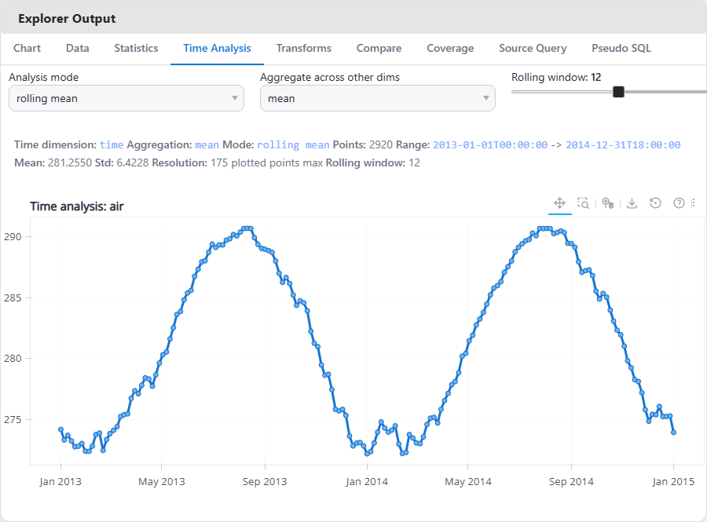
</p>

The `Time Analysis` tab adds a more scientific workflow: aggregate over non-time dimensions, switch between raw, rolling mean, anomaly, cumulative, and trend views, and inspect the resulting time series directly.

### 9. Query Planning

<p align="center">
  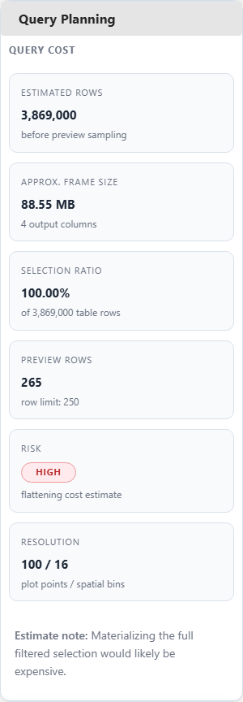
</p>

The query-planning card shows estimated full rows, approximate DataFrame size, risk level, and active plot/spatial resolution controls before a full flattening step would happen.

### 10. Rolling Mean Transform

<p align="center">
  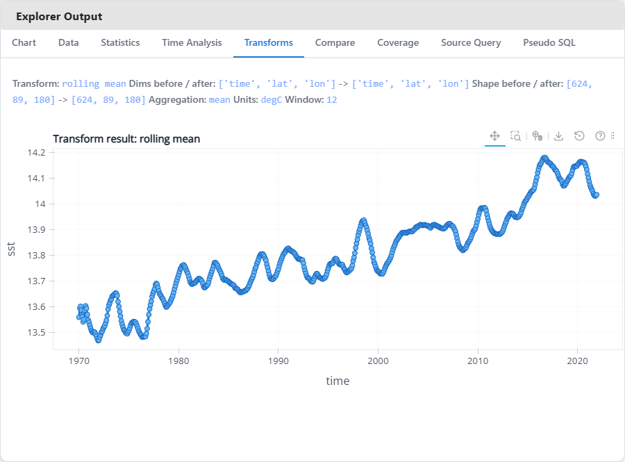
</p>

The transform surface keeps the computation inside xarray, then exposes a reduced view for explorer output instead of flattening the full dataset first.

### 11. Anomaly Transform

<p align="center">
  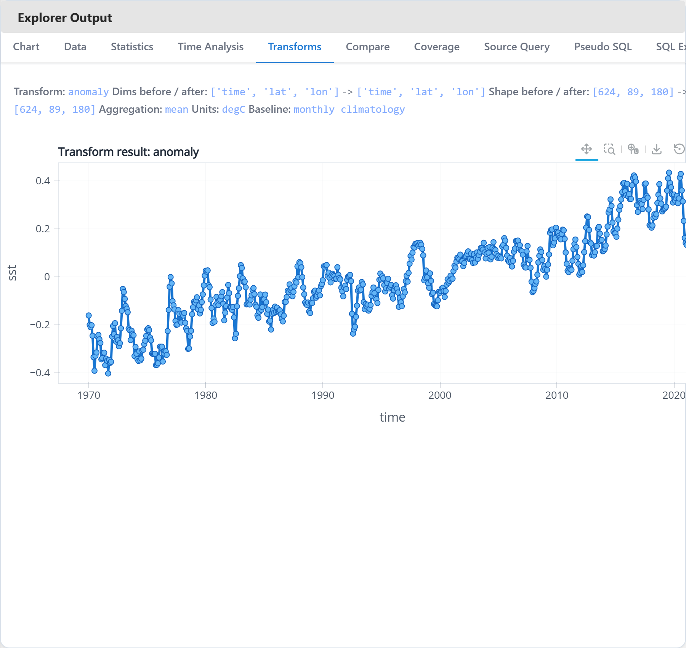
</p>

Anomaly mode makes time-series deviations easy to inspect on real climate data without leaving the explorer.

### 12. Resample Transform

<p align="center">
  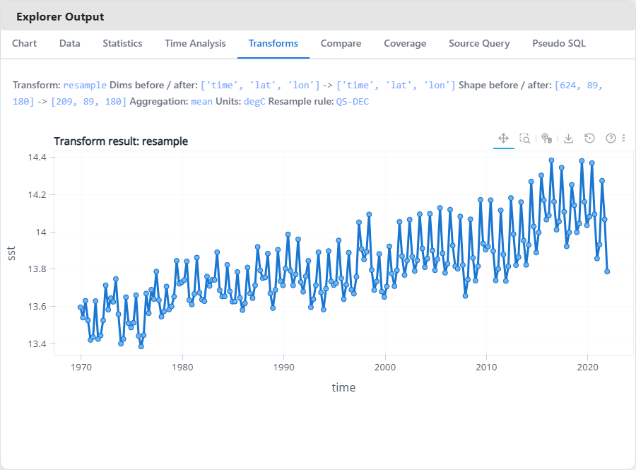
</p>

Resampling demonstrates a practical upstream-friendly scientific transform: temporal aggregation in xarray, preview in Lumen-style UI.

### 13. Spatial Mean Transform

<p align="center">
  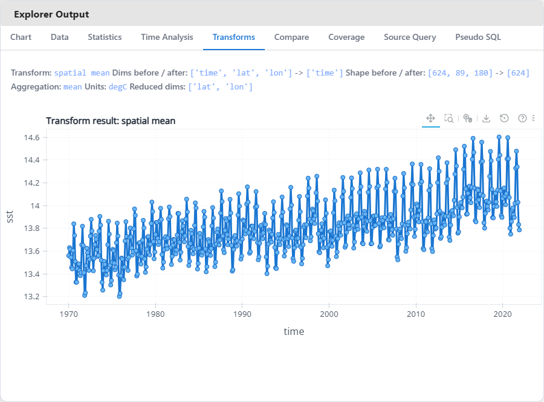
</p>

Spatial-mean reduction collapses latitude and longitude before preview, which is exactly the type of scientific reduction that should happen before DataFrame materialization.

### 14. GeoViews Map

<p align="center">
  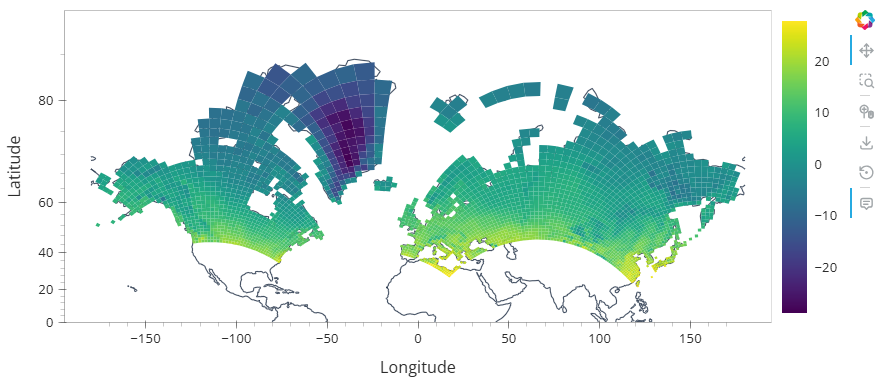
</p>

GeoViews map mode adds a more scientific map surface with coastlines and curvilinear-grid rendering, which is a visibly stronger scientific-data story than a generic scatter plot.

### 15. AI Assist

<p align="center">
  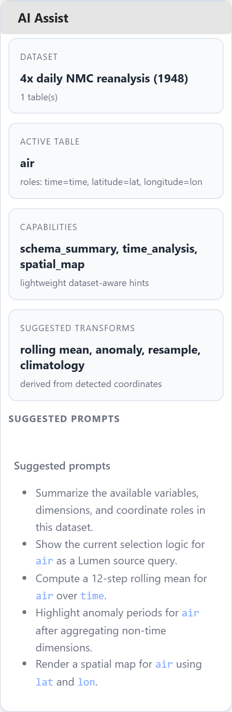
</p>

The AI assist surface stays intentionally lightweight: dataset-aware prompt suggestions, capability hints, and transform recommendations derived directly from detected coordinates and available tables.

### 16. SQL Explorer

<p align="center">
  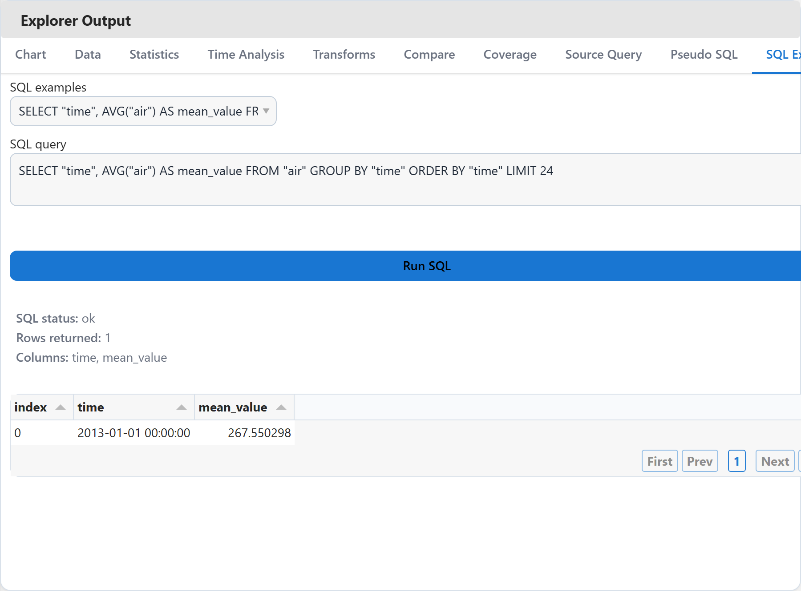
</p>

The SQL explorer is intentionally lightweight: it runs bounded `SELECT` queries over preview-sized DataFrames so reviewers can inspect table logic without pretending the lab already has a production SQL backend.

---

## Real-World Validation: NOAA ERSSTv5

The screenshots below come from the bundled NOAA ERSSTv5 sea-surface-temperature dataset at `assets/sample_data/ersstv5.nc`.

This validation pass matters because it exercises a real monthly climate dataset with `time`, `lat`, and `lon` coordinates, a nearly 10 million-row full flattening surface, and descending latitude coordinates that forced a real bugfix in the query helper.

<table>
  <tr>
    <td width="56%">
      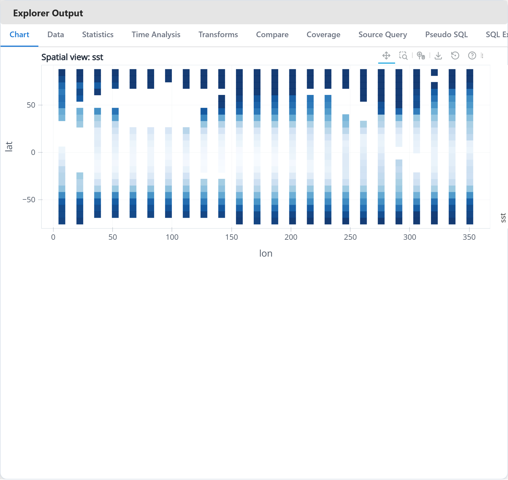
    </td>
    <td width="44%">
      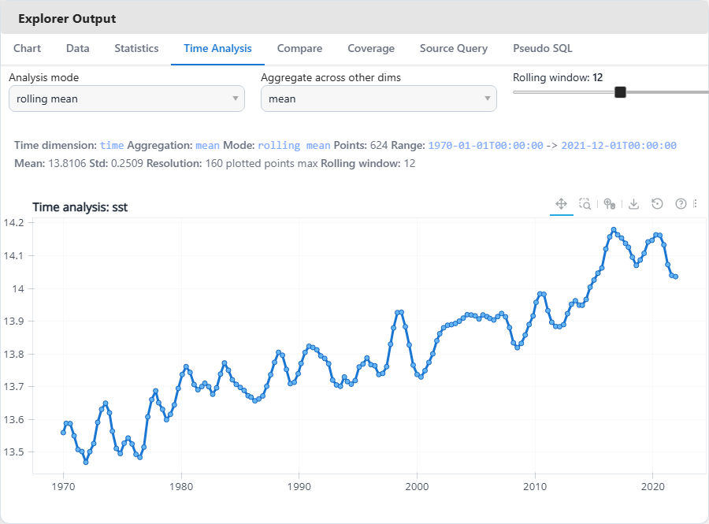
    </td>
  </tr>
  <tr>
    <td><strong>Spatial overview:</strong> ERSSTv5 loaded directly into the explorer and rendered as a coordinate-aware SST surface.</td>
    <td><strong>Time analysis:</strong> 624 monthly observations summarized as a 12-step rolling mean across non-time dimensions.</td>
  </tr>
  <tr>
    <td width="50%">
      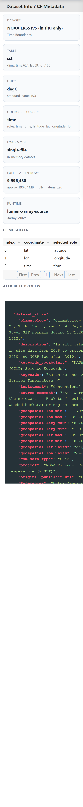
    </td>
    <td width="50%">
      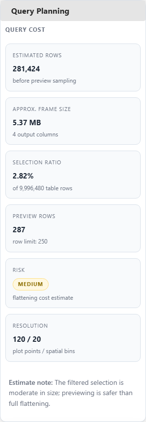
    </td>
  </tr>
  <tr>
    <td><strong>Dataset info / CF metadata:</strong> runtime, units, coordinate roles, shape, and source attributes remain visible for a real NOAA dataset.</td>
    <td><strong>Query planning:</strong> filtered ERSSTv5 selections now produce a meaningful cost estimate after fixing descending-latitude range handling.</td>
  </tr>
</table>

### Architecture Diagram

<p align="center">
  
</p>

The repo also includes proposal-ready visuals explaining how xarray selection stays upstream of the DataFrame boundary.

---

## Why This Repo Exists

Lumen is built around tabular sources. xarray datasets are labeled, multidimensional, and coordinate-aware.

This lab exists to prove that those two models can meet cleanly:

- xarray stays responsible for coordinate-aware selection
- Lumen still receives stable DataFrame outputs at the boundary
- schema, metadata, and coordinate roles remain visible to the user
- interactive dashboards do not blindly flatten large scientific datasets

This repository is not meant to replace upstream `lumen`. It is a companion repo for:

- demos and screenshots
- proposal evidence
- benchmark notes
- experiments that are useful but not yet upstream-ready

## What This Repo Proves

| Proposal claim | Evidence in this repo |
|---|---|
| xarray-backed datasets can be explored through a Lumen-style workflow | `examples/dashboard_app.py`, Explorer UI, screenshots, GIF |
| coordinate-aware filtering can happen before flattening | `src/lumen_xarray_lab/datasets.py`, explorer query flow |
| schema, metadata, and coordinate roles can be surfaced in the UI | explorer summary panels, coordinate tables, curvilinear CF helpers |
| multi-file, transform, and map workflows can stay inside the same source boundary | `open_mfdataset`-aware loading, transform tab, GeoViews gallery views |
| the feature can be tested and documented honestly | `tests/`, `docs/benchmarks.md`, `docs/upstream-plan.md`, generated screenshot gallery |
| the work can be split into demo-only vs upstream-ready pieces | fallback runtime design plus upstream-plan doc |

## Feature Overview

### Implemented now

- Explorer-style dashboard with in-app dataset loading
- local path, URI, bundled sample, and upload-based dataset loading
- glob-based multi-file loading with `open_mfdataset`-first behavior and deterministic combine fallback
- table switching across xarray `data_vars`
- coordinate-aware filters derived from queryable 1D coordinates
- line, scatter, bar, histogram, and spatial chart modes
- GeoViews-based map rendering for a curvilinear-grid demo subset
- statistics, coverage, comparison, and export panels
- dedicated time-analysis workflows for rolling mean, anomaly, cumulative, and trend views
- scientific transforms for rolling mean, anomaly, resample, climatology, spatial mean, and zonal mean
- lightweight AI assist with dataset-aware prompts and transform suggestions
- lightweight SQL explorer over bounded DataFrame previews
- dataset info and CF metadata pane in the explorer rail
- query cost estimation plus plot/spatial resolution controls
- source query and pseudo-SQL preview
- coordinate-role detection for `time`, `latitude`, `longitude`, and `vertical`, including curvilinear map candidates
- schema enrichment and runtime/source diagnostics
- benchmark scripts plus published local benchmark outputs
- screenshot and GIF capture flow for proposal/demo assets
- branded README assets and feature-by-feature screenshot gallery

### Deliberately still experimental

- SQL-backed xarray access
- richer AI upload integration beyond simple previews
- broader benchmark publication across multiple environments
- any claim that depends on unimplemented SQL or distributed execution paths

## Explorer Highlights

- `Load Dataset` sidebar lets you switch datasets without restarting the app.
- `Bundled sample` is the fastest way to demo the explorer.
- `Feature Tour` screenshots in this README are generated from the scripted capture flow, not mocked up manually.
- `Source Query` shows the source-level call shape for the current selection.
- `Pseudo SQL` gives a familiar mental model for reviewers who think in SQL first.
- `SQL Explorer` executes bounded `SELECT` queries over preview-sized tables for reviewer-friendly inspection.
- `Compare` works when the loaded dataset has multiple variables on shared coordinates.
- `Spatial` view uses detected latitude and longitude columns when available.
- `Transforms` keep rolling mean, anomaly, resample, climatology, spatial mean, and zonal mean inside xarray before previewing the result.
- `GeoViews Map` uses a curvilinear-grid sample to demonstrate a more serious scientific visualization path than a generic scatter map.
- `AI Assist` suggests prompts and transform ideas directly from detected coordinate roles and table structure.

## Runtime Model

The lab runs in two modes:

1. If a sibling `lumen` checkout exposes `lumen.sources.xarray.XarraySource`, the lab uses it.
2. Otherwise, it falls back to a local `LabXarraySourceAdapter` so demos and tests still work in isolation.

That gives this repo two useful properties:

- it stays runnable as a standalone public demo repo
- it still acts as a realistic proving ground for upstream xarray source work

## Quick Start

Install the project in editable mode:

```bash
pip install -e .[test]
```

Install the richer scientific demo stack if you want GeoViews maps and media export:

```bash
pip install -e .[demo,test]
```

Run the main examples:

```bash
python examples/quickstart.py
python examples/air_temperature_demo.py
python examples/ai_upload_demo.py
python examples/sql_explorer_demo.py
```

Launch the explorer:

```bash
panel serve examples/dashboard_app.py --show
```

Preload a dataset at startup if you want:

```bash
panel serve examples/dashboard_app.py --show --args "C:\path\to\dataset.nc"
```

Inside the dashboard you can:

- load a local `.nc` file path
- load a local `.zarr` directory path
- open a bundled sample dataset
- upload a single NetCDF/HDF file into the session

Run the test suite:

```bash
pytest -q
```

## Bundled Sample Datasets

The repo includes small local datasets for reliable demos:

- `assets/sample_data/air_temperature.nc`
- `assets/sample_data/rasm.nc`
- `assets/sample_data/ersstv5.nc`
- `assets/sample_data/compare_weather.nc`
- `assets/sample_data/curvilinear_rasm_demo.nc`
- `assets/sample_data/multi_air_temperature/*.nc`

Recommended demo order:

1. `air_temperature` for a clean first walkthrough
2. `multi_air_temperature` for split-file loading
3. `compare_weather` for the compare panel
4. `curvilinear_rasm_demo` for CF metadata and GeoViews maps
5. `ersstv5` for a heavier real-world climate-style dataset
6. `rasm` for the full curvilinear source file behind the smaller demo subset

## Benchmarks And Limits

The benchmark story in this repo is intentionally conservative.

Current published results:

- medium `time x lat x lon` selection estimate: `3,869,000` flattened rows
- rough 4-column DataFrame estimate for that selection: about `118.07 MB`
- large climate-style grid estimate: `378,957,600` rows and about `11.29 GB`
- local NetCDF open timing for the small demo dataset: `0.3703 s`
- split multi-file sample open timing: `1.4488 s` vs `0.5291 s` for the single-file baseline
- ERSSTv5 transform timings: rolling mean `1.7886 s`, anomaly `0.2499 s`, resample `0.2403 s`, climatology `0.1266 s`, spatial mean `0.0933 s`, zonal mean `0.0785 s`

Read the full notes here:

- [Benchmark notes](docs/benchmarks.md)
- [flattening_vs_sql.json](benchmarks/results/flattening_vs_sql.json)
- [netcdf_vs_zarr.json](benchmarks/results/netcdf_vs_zarr.json)
- [large_grid_limits.json](benchmarks/results/large_grid_limits.json)
- [multifile_loading.json](benchmarks/results/multifile_loading.json)
- [transform_timings.json](benchmarks/results/transform_timings.json)

The main takeaway is simple: filter first in xarray, flatten last, and protect the boundary with `max_rows`.

## Media Pipeline

Export the dashboard snapshot only:

```bash
python scripts/make_screenshots.py --html-only
```

Capture the full media set:

```bash
pip install -e .[demo]
python -m playwright install chromium
python scripts/make_screenshots.py
python scripts/make_gif.py
```

Generated assets:

- `assets/screenshots/dashboard_desktop.png`
- `assets/screenshots/dashboard_mobile.png`
- `assets/screenshots/gallery/*.png`
- `assets/screenshots/real_world/*.png`
- `docs/screenshots/story_frames/*.png`
- `docs/gifs/dashboard_walkthrough.gif`

The gallery and real-world screenshots used in this README are exported from the app itself so the repository visuals stay aligned with the current implementation.

## Repository Layout

```text
lumen-xarray-lab/
|- README.md
|- docs/
|- src/lumen_xarray_lab/
|- examples/
|- benchmarks/
|- scripts/
|- tests/
`- assets/
```

## Useful Entry Points

- [Architecture notes](docs/architecture.md)
- [Benchmark notes](docs/benchmarks.md)
- [Roadmap](docs/roadmap.md)
- [Upstream plan](docs/upstream-plan.md)
- [Dashboard app](examples/dashboard_app.py)
- [Runtime/data layer](src/lumen_xarray_lab/datasets.py)
- [CF helpers](src/lumen_xarray_lab/cf.py)
- [Explorer UI](src/lumen_xarray_lab/dashboard/explorer.py)
- [Proposal diagram](assets/diagrams/xarray_source_proposal_diagram.svg)

## Relationship To Upstream Lumen

This lab repo is intentionally not the main implementation story.

The core contribution should still land in upstream `lumen` through:

- `XarraySource`
- tests
- docs
- runnable examples

The lab repo is where the surrounding proof lives:

- screenshots and GIFs
- benchmark notes
- demo-first explorer workflow
- experimental features that are not yet ready to merge upstream

## Scope Discipline

This README is intentionally strict about what is real today.

The goal is not to publish the longest feature list. The goal is to make the repository easy to trust:

- every major claim maps to runnable code
- the public demo matches the current implementation
- benchmarks are published with caveats
- experimental work stays labeled as experimental
