# lumen-xarray-lab

<p align="center">
  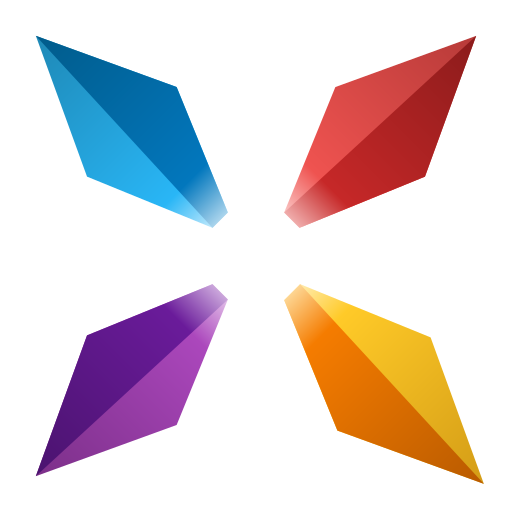
  <span>&nbsp;&nbsp;&nbsp;</span>
  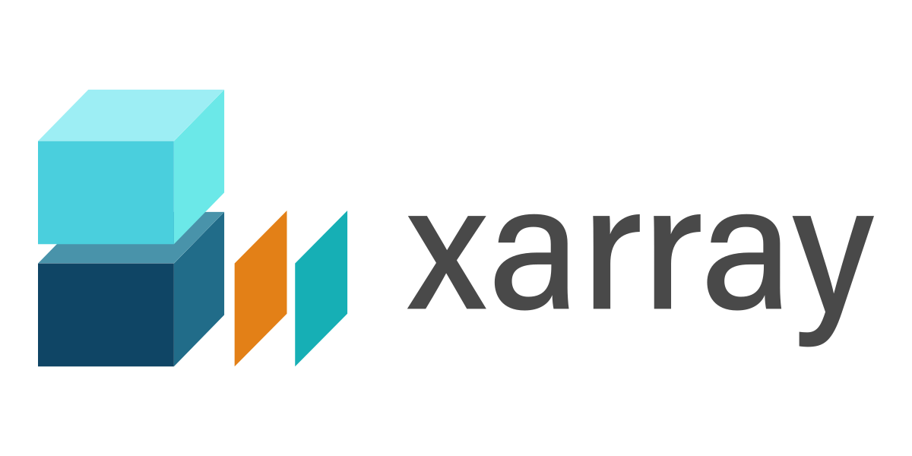
</p>

<p align="center">
  Prototype evidence for bringing a native <strong>xarray</strong> workflow into <strong>Lumen</strong>.
</p>

<p align="center">
  <a href="docs/architecture.md">Architecture</a> |
  <a href="docs/benchmarks.md">Benchmarks</a> |
  <a href="docs/proposal-alignment.md">Proposal Alignment</a> |
  <a href="docs/reviewer-guide.md">Reviewer Guide</a> |
  <a href="docs/upstream-plan.md">Upstream Plan</a> |
  <a href="examples/dashboard_app.py">Dashboard App</a> |
  <a href="assets/diagrams/xarray_source_proposal_diagram.svg">Proposal Diagram</a>
</p>

<p align="center">
  <strong>xarray-native selection. Lumen-native integration. Proposal-ready proof.</strong>
</p>

> **GSoC reviewer summary**
>
> - **Goal:** prove that Lumen can support xarray datasets without losing its tabular source boundary.
> - **Already working here:** runnable explorer, tested source/runtime adapter, coordinate-aware filtering, screenshots, GIFs, and benchmark notes.
> - **Upstream position:** this repo is a companion prototype, not a replacement for upstream `lumen`.
> - **Best files to inspect first:** [`docs/architecture.md`](docs/architecture.md), [`docs/proposal-alignment.md`](docs/proposal-alignment.md), [`docs/upstream-plan.md`](docs/upstream-plan.md), [`src/lumen_xarray_lab/datasets.py`](src/lumen_xarray_lab/datasets.py), and [`examples/dashboard_app.py`](examples/dashboard_app.py).

## Proof At A Glance

<table>
  <tr>
    <td width="25%"><strong>46 passing tests</strong><br />Explorer, runtime, export, schema, CF, and benchmark helpers are covered by the current suite.</td>
    <td width="25%"><strong>9 feature screenshots</strong><br />Every gallery image in this README is generated from the running app, not mocked manually.</td>
    <td width="25%"><strong>5 sample datasets</strong><br />The repo includes built-in data for line, spatial, compare, and coordinate-intelligence demos.</td>
    <td width="25%"><strong>5 reviewer docs</strong><br />Architecture, benchmarks, reviewer guide, proposal alignment, and upstream plan make the repo easy to evaluate quickly.</td>
  </tr>
</table>

## Mentor Quick Check

If a mentor wants to evaluate the prototype fast, these are the highest-signal checks:

1. Open the GIF and screenshot gallery to verify the explorer is already usable.
2. Read [`docs/proposal-alignment.md`](docs/proposal-alignment.md) to see how the current repo maps to the proposal milestones.
3. Read [`docs/architecture.md`](docs/architecture.md) to confirm the xarray-to-DataFrame boundary is explicit.
4. Inspect [`src/lumen_xarray_lab/datasets.py`](src/lumen_xarray_lab/datasets.py) and [`src/lumen_xarray_lab/cf.py`](src/lumen_xarray_lab/cf.py) for the core runtime and coordinate-role logic.
5. Run `pytest -q` and `panel serve examples/dashboard_app.py --show` to validate the proof locally.

## Reviewer Snapshot

This repository exists to de-risk an upstream `XarraySource` contribution.

Lumen is designed around tabular sources. xarray is multidimensional, coordinate-aware, and often too large to flatten naively. The prototype here focuses on the narrow integration boundary that matters for upstream review:

- apply coordinate-aware selection in xarray first
- expose stable DataFrame results only at the source boundary
- surface schema, metadata, and detected coordinate roles in the UI
- document the limits honestly instead of over-claiming scope

What is intentionally in scope here:

- proof that an explorer-style experience can sit on top of xarray-backed data
- evidence that query, preview, statistics, coverage, and plotting can work on filtered selections
- benchmark notes showing why `filter first, flatten last` is necessary
- a clear split between upstream-ready work and experimental work

What is intentionally not the main story:

- replacing upstream `lumen`
- claiming distributed execution or SQL support as finished work
- treating the lab repo as the core implementation instead of proposal evidence

## Why This Stands Out

The strongest version of this project is not "more features than another demo."
It is a more reviewable and more upstream-credible prototype.

- **Upstream-first:** the repo is built to support `lumen`, not compete with it.
- **Real proof:** the screenshots, GIFs, and explorer flows are generated from the running app.
- **Clear boundary:** xarray stays responsible for multidimensional selection, while Lumen still sees stable tabular outputs.
- **Honest limits:** experimental pieces are labeled as experimental instead of being mixed into the core story.
- **Reviewer efficiency:** architecture, benchmarks, screenshots, tests, and upstream plan are easy to inspect in a few minutes.

If you want the fast review path, start with [`docs/reviewer-guide.md`](docs/reviewer-guide.md).
If you want the proposal-to-prototype mapping, start with [`docs/proposal-alignment.md`](docs/proposal-alignment.md).

## Preview

<p align="center">
  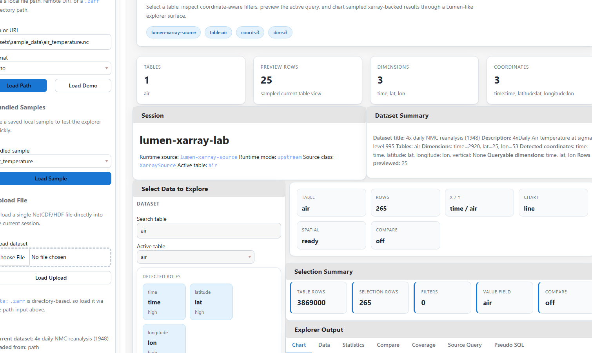
</p>

The GIF below is meant to answer the reviewer question quickly: does the prototype already behave like a usable xarray-backed explorer, or is it still a concept? This repo is structured so the answer is visible before reading any code.

<table>
  <tr>
    <td width="72%">
      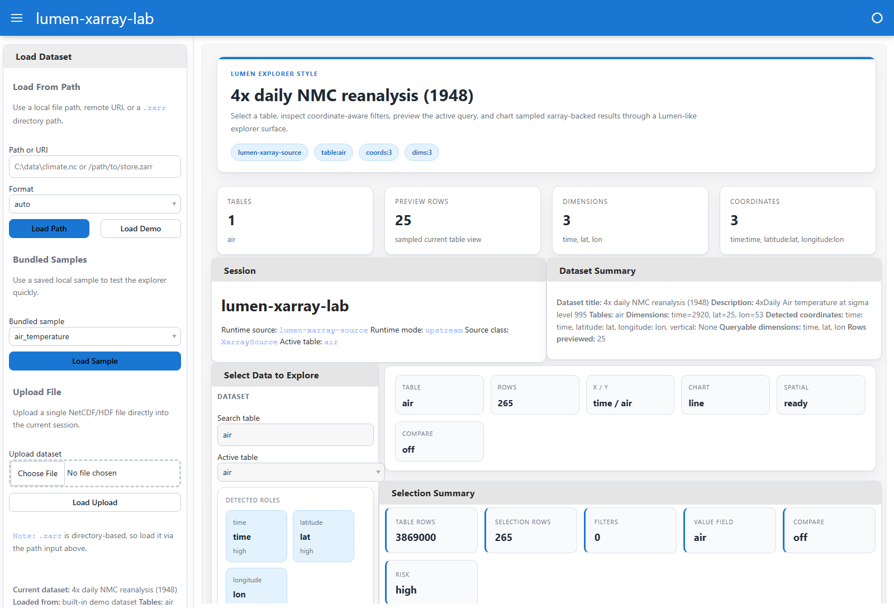
    </td>
    <td width="28%">
      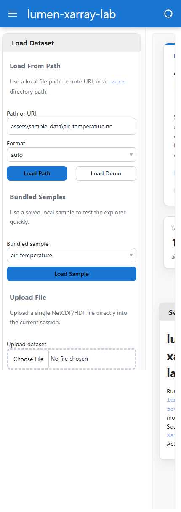
    </td>
  </tr>
  <tr>
    <td><strong>Desktop:</strong> Explorer-style surface with dataset loading, coordinate-aware filters, query previews, chart output, and dataset diagnostics.</td>
    <td><strong>Mobile:</strong> Same workflow rendered in a narrower layout for proposal screenshots and quick validation.</td>
  </tr>
</table>

## Feature Tour

Every image below is generated from the dashboard itself through the scripted capture flow.

### 1. Explorer Overview

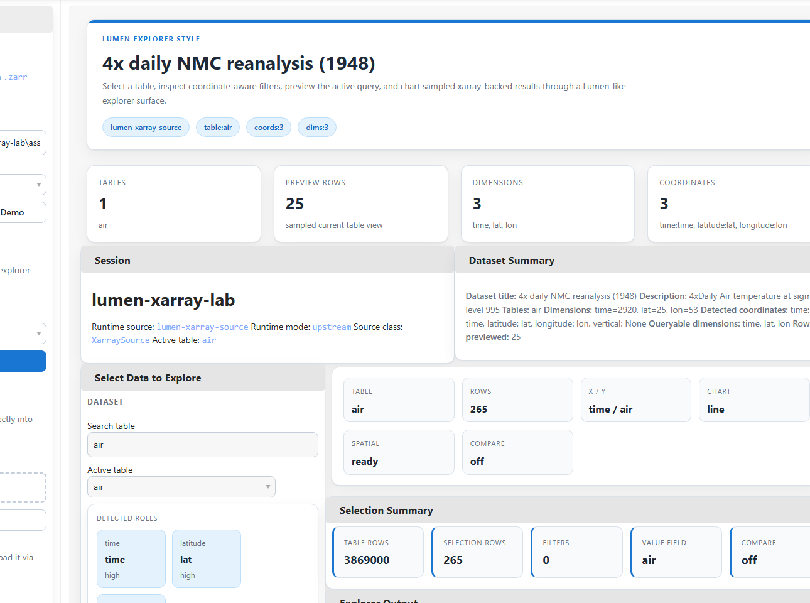

Dataset summary, table switching, axis controls, filter controls, and the explorer output surface are all visible in one frame.

### 2. Chart Output

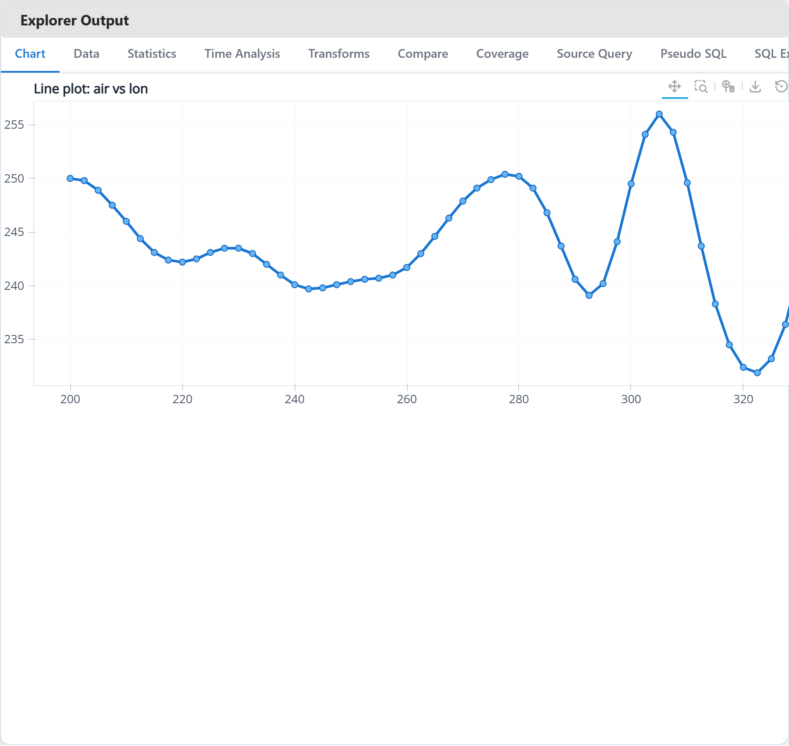

The default chart view shows sampled, query-aware table output as a chart without flattening the entire dataset.

### 3. Spatial Plot

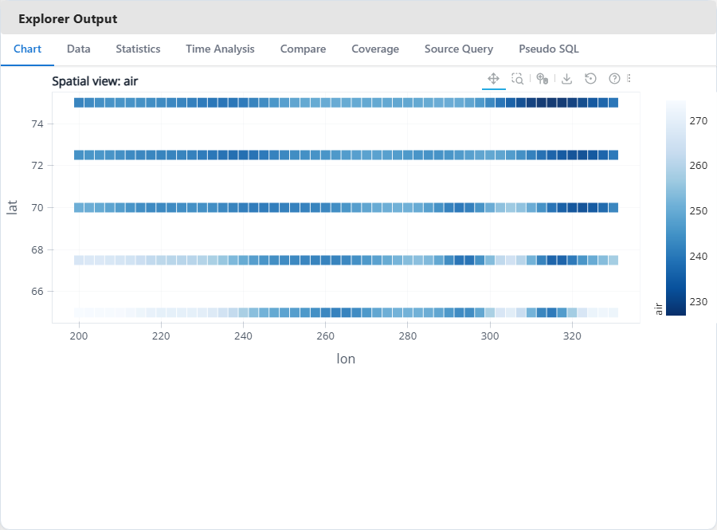

Latitude and longitude roles are detected and used to unlock a spatial chart mode for gridded scientific data.

### 4. Data Table

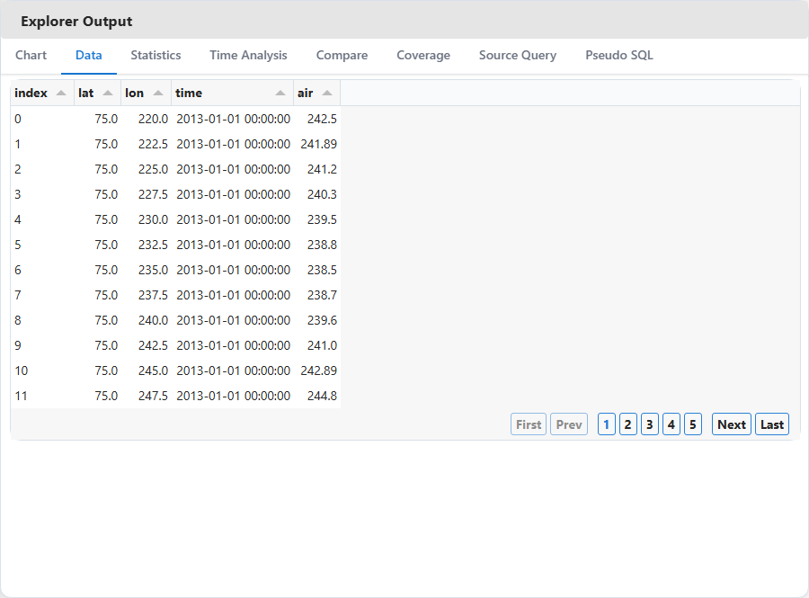

The `Data` tab exposes the current sampled selection as a readable table for quick inspection and validation.

### 5. Statistics

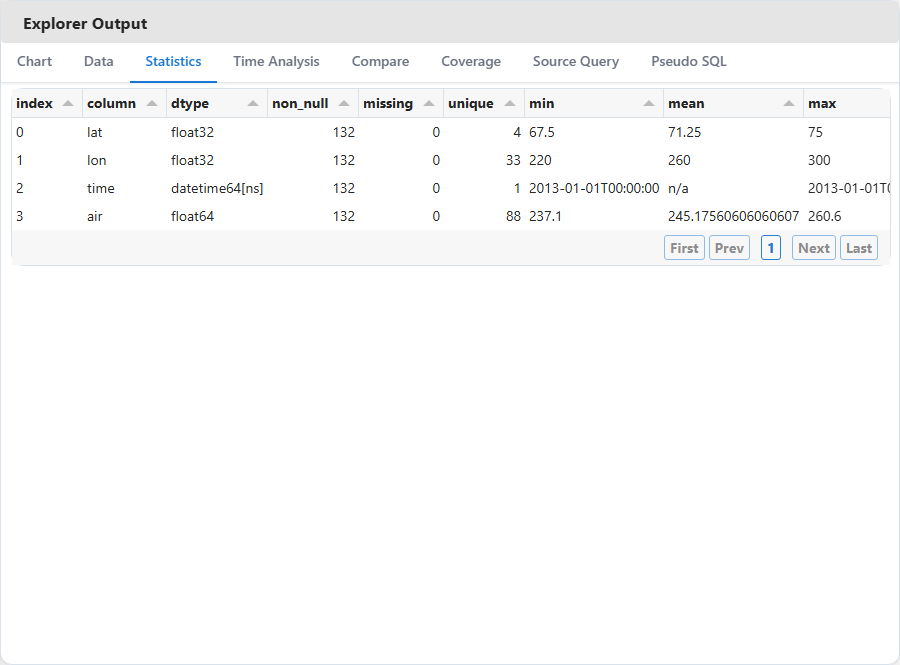

The `Statistics` tab summarizes nulls, unique counts, ranges, and numeric aggregates for the current selection.

### 6. Compare Variables

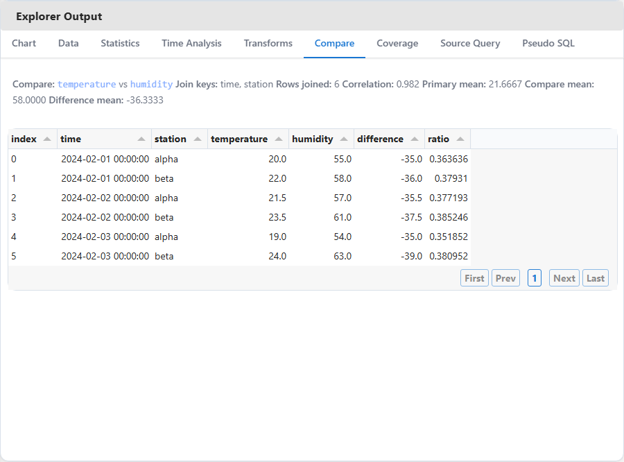

The compare workflow aligns two variables on shared coordinates and surfaces joined rows plus difference and ratio metrics.

### 7. Coverage

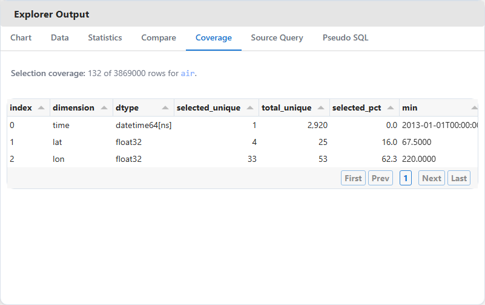

Coverage analysis shows how much of each dimension remains after coordinate-aware filtering.

### 8. Source Query

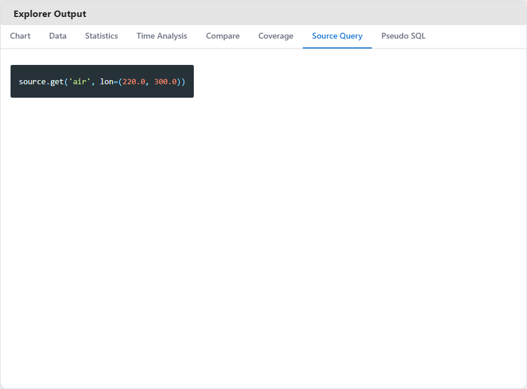

The source query preview makes the xarray-backed `source.get(...)` call visible for the active explorer selection.

### 9. Pseudo SQL

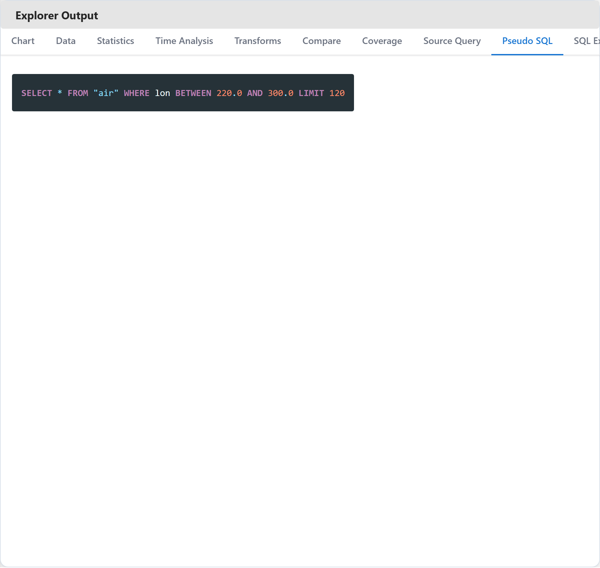

Pseudo SQL gives reviewers a familiar table-style mental model for the current selection and row limit.

### 10. Architecture Diagram

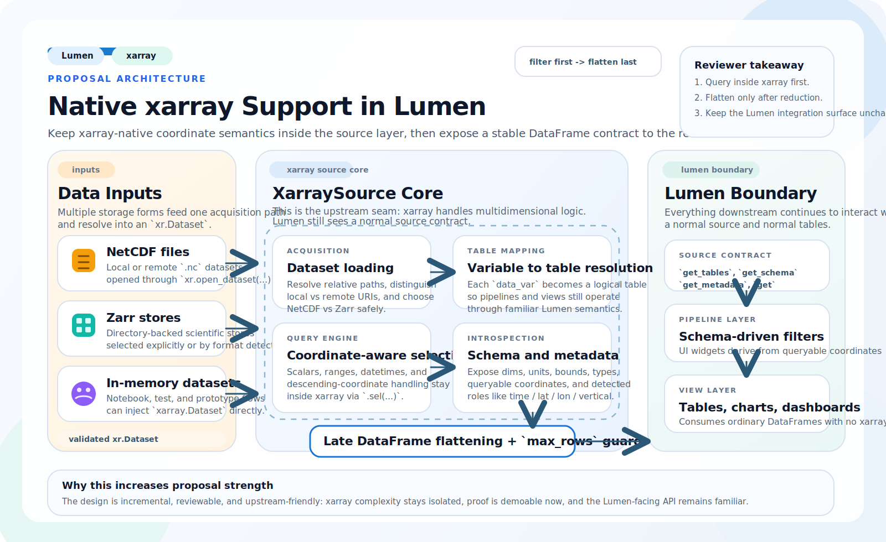

The repo also includes proposal-ready visuals explaining how xarray selection stays upstream of the DataFrame boundary.

## Why This Repo Exists

Lumen is built around tabular sources. xarray datasets are labeled, multidimensional, and coordinate-aware.

This lab exists to prove that those two models can meet cleanly:

- xarray stays responsible for coordinate-aware selection
- Lumen still receives stable DataFrame outputs at the boundary
- schema, metadata, and coordinate roles remain visible to the user
- interactive dashboards do not blindly flatten large scientific datasets

This repository is not meant to replace upstream `lumen`. It is a companion repo for:

- demos and screenshots
- proposal evidence
- benchmark notes
- experiments that are useful but not yet upstream-ready

## What This Repo Proves

| Proposal claim | Evidence in this repo |
|---|---|
| xarray-backed datasets can be explored through a Lumen-style workflow | `examples/dashboard_app.py`, Explorer UI, screenshots, GIF |
| coordinate-aware filtering can happen before flattening | `src/lumen_xarray_lab/datasets.py`, explorer query flow |
| schema, metadata, and coordinate roles can be surfaced in the UI | explorer summary panels, coordinate tables, CF helpers |
| the feature can be tested and documented honestly | `tests/`, `docs/benchmarks.md`, `docs/upstream-plan.md` |
| the work can be split into demo-only vs upstream-ready pieces | fallback runtime design plus upstream-plan doc |

## Feature Overview

### Implemented now

- Explorer-style dashboard with in-app dataset loading
- local path, URI, bundled sample, and upload-based dataset loading
- table switching across xarray `data_vars`
- coordinate-aware filters derived from queryable 1D coordinates
- line, scatter, bar, histogram, and spatial chart modes
- statistics, coverage, comparison, and export panels
- source query and pseudo-SQL preview
- coordinate-role detection for `time`, `latitude`, `longitude`, and `vertical`
- schema enrichment and runtime/source diagnostics
- benchmark scripts plus published local benchmark outputs
- screenshot and GIF capture flow for proposal/demo assets
- branded README assets and feature-by-feature screenshot gallery

### Deliberately still experimental

- SQL-backed xarray access
- richer AI upload integration beyond simple previews
- broader benchmark publication across multiple environments
- any claim that depends on unimplemented SQL or distributed execution paths

## Explorer Highlights

- `Load Dataset` sidebar lets you switch datasets without restarting the app.
- `Bundled sample` is the fastest way to demo the explorer.
- `Feature Tour` screenshots in this README are generated from the scripted capture flow, not mocked up manually.
- `Source Query` shows the source-level call shape for the current selection.
- `Pseudo SQL` gives a familiar mental model for reviewers who think in SQL first.
- `Compare` works when the loaded dataset has multiple variables on shared coordinates.
- `Spatial` view uses detected latitude and longitude columns when available.

## Runtime Model

The lab runs in two modes:

1. If a sibling `lumen` checkout exposes `lumen.sources.xarray.XarraySource`, the lab uses it.
2. Otherwise, it falls back to a local `LabXarraySourceAdapter` so demos and tests still work in isolation.

That gives this repo two useful properties:

- it stays runnable as a standalone public demo repo
- it still acts as a realistic proving ground for upstream xarray source work

## Quick Start

Install the project in editable mode:

```bash
pip install -e .[test]
```

Run the main examples:

```bash
python examples/quickstart.py
python examples/air_temperature_demo.py
python examples/ai_upload_demo.py
python examples/sql_explorer_demo.py
```

Launch the explorer:

```bash
panel serve examples/dashboard_app.py --show
```

Preload a dataset at startup if you want:

```bash
panel serve examples/dashboard_app.py --show --args "C:\path\to\dataset.nc"
```

Inside the dashboard you can:

- load a local `.nc` file path
- load a local `.zarr` directory path
- open a bundled sample dataset
- upload a single NetCDF/HDF file into the session

Run the test suite:

```bash
pytest -q
```

## Bundled Sample Datasets

The repo includes small local datasets for reliable demos:

- `assets/sample_data/air_temperature.nc`
- `assets/sample_data/rasm.nc`
- `assets/sample_data/ersstv5.nc`
- `assets/sample_data/compare_weather.nc`

Recommended demo order:

1. `air_temperature` for a clean first walkthrough
2. `rasm` for coordinate-role detection on less obvious dimensions
3. `compare_weather` for the compare panel
4. `ersstv5` for a heavier real-world climate-style dataset

## Benchmarks And Limits

The benchmark story in this repo is intentionally conservative.

Current published results:

- medium `time x lat x lon` selection estimate: `3,869,000` flattened rows
- rough 4-column DataFrame estimate for that selection: about `118.07 MB`
- large climate-style grid estimate: `378,957,600` rows and about `11.29 GB`
- local NetCDF open timing for the small demo dataset: `0.3703 s`

Read the full notes here:

- [Benchmark notes](docs/benchmarks.md)
- [flattening_vs_sql.json](benchmarks/results/flattening_vs_sql.json)
- [netcdf_vs_zarr.json](benchmarks/results/netcdf_vs_zarr.json)
- [large_grid_limits.json](benchmarks/results/large_grid_limits.json)

The main takeaway is simple: filter first in xarray, flatten last, and protect the boundary with `max_rows`.

## Media Pipeline

Export the dashboard snapshot only:

```bash
python scripts/make_screenshots.py --html-only
```

Capture the full media set:

```bash
pip install -e .[demo]
python -m playwright install chromium
python scripts/make_screenshots.py
python scripts/make_gif.py
```

Generated assets:

- `assets/screenshots/dashboard_desktop.png`
- `assets/screenshots/dashboard_mobile.png`
- `assets/screenshots/gallery/*.png`
- `docs/screenshots/story_frames/*.png`
- `docs/gifs/dashboard_walkthrough.gif`

The gallery screenshots used in this README are exported from the app itself so the repository visuals stay aligned with the current implementation.

## Repository Layout

```text
lumen-xarray-lab/
|- README.md
|- docs/
|- src/lumen_xarray_lab/
|- examples/
|- benchmarks/
|- scripts/
|- tests/
`- assets/
```

## Useful Entry Points

- [Architecture notes](docs/architecture.md)
- [Benchmark notes](docs/benchmarks.md)
- [Roadmap](docs/roadmap.md)
- [Upstream plan](docs/upstream-plan.md)
- [Dashboard app](examples/dashboard_app.py)
- [Runtime/data layer](src/lumen_xarray_lab/datasets.py)
- [CF helpers](src/lumen_xarray_lab/cf.py)
- [Explorer UI](src/lumen_xarray_lab/dashboard/explorer.py)
- [Proposal diagram](assets/diagrams/xarray_source_proposal_diagram.svg)

## Relationship To Upstream Lumen

This lab repo is intentionally not the main implementation story.

The core contribution should still land in upstream `lumen` through:

- `XarraySource`
- tests
- docs
- runnable examples

The lab repo is where the surrounding proof lives:

- screenshots and GIFs
- benchmark notes
- demo-first explorer workflow
- experimental features that are not yet ready to merge upstream

## Scope Discipline

This README is intentionally strict about what is real today.

The goal is not to publish the longest feature list. The goal is to make the repository easy to trust:

- every major claim maps to runnable code
- the public demo matches the current implementation
- benchmarks are published with caveats
- experimental work stays labeled as experimental
