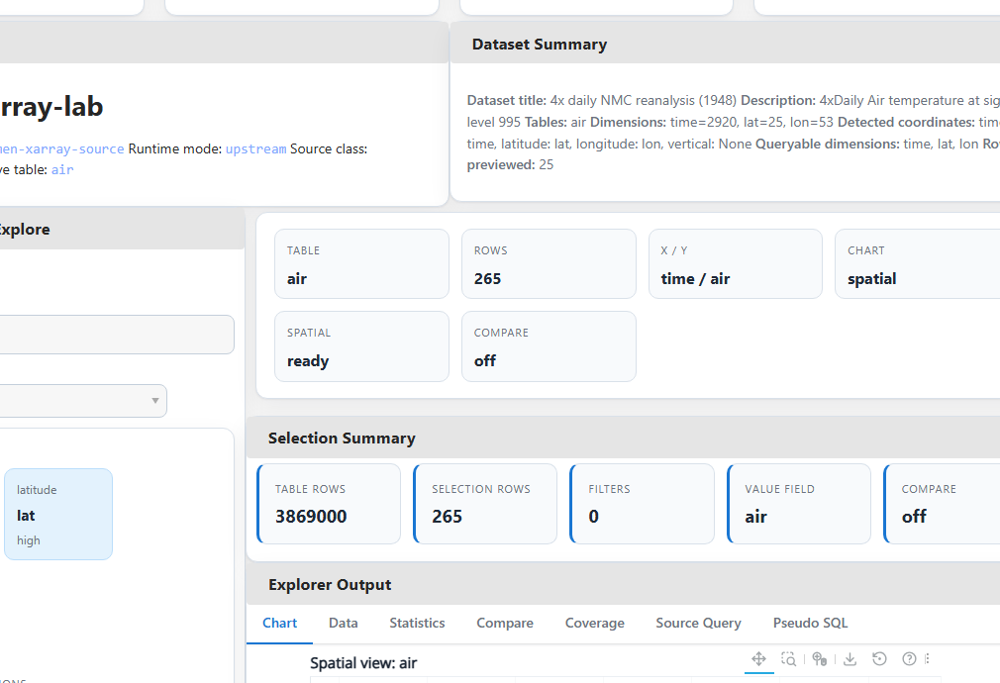
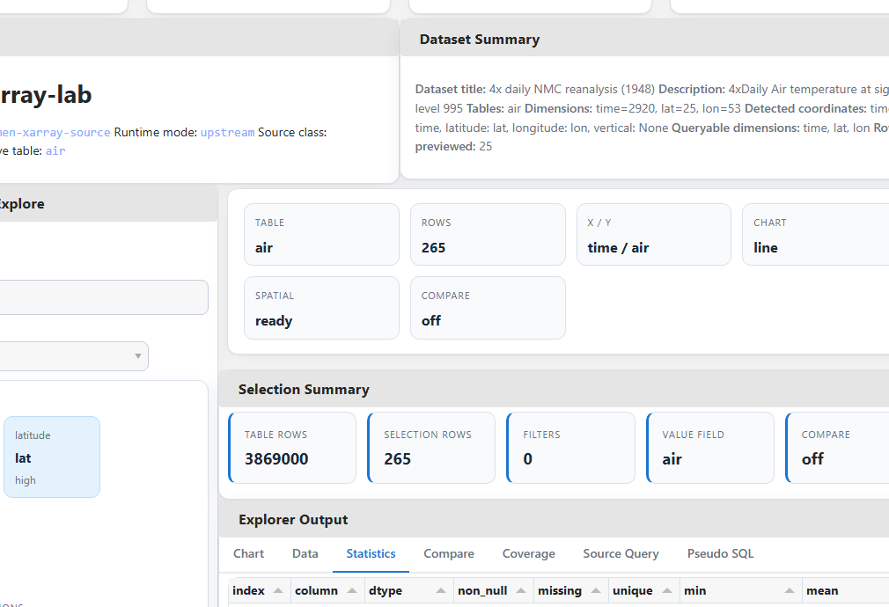
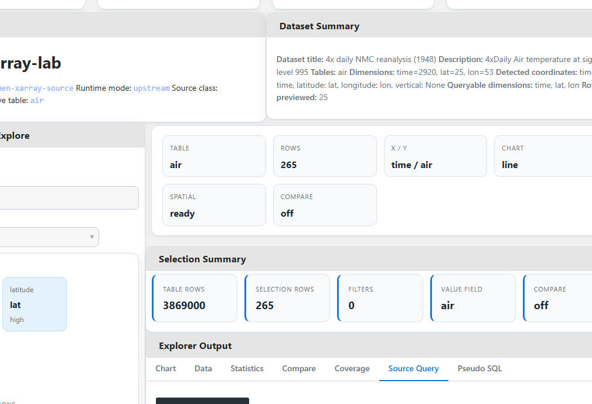
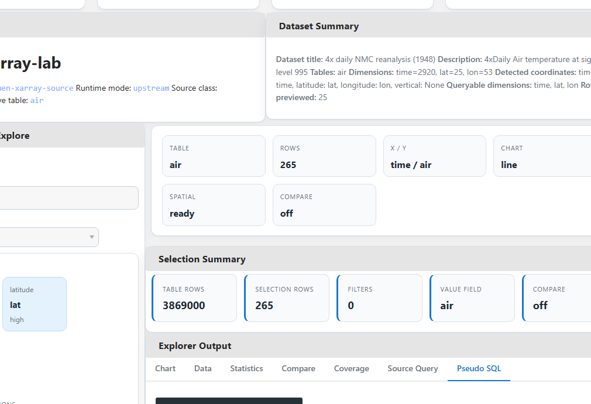

# lumen-xarray-lab

<p align="center">
  
  <span>&nbsp;&nbsp;&nbsp;</span>
  
</p>

<p align="center">
  Companion demos, experiments, benchmarks, and proposal assets for bringing <strong>xarray</strong> into <strong>Lumen</strong>.
</p>

<p align="center">
  <a href="docs/architecture.md">Architecture</a> |
  <a href="docs/benchmarks.md">Benchmarks</a> |
  <a href="docs/upstream-plan.md">Upstream Plan</a> |
  <a href="examples/dashboard_app.py">Dashboard App</a> |
  <a href="assets/diagrams/xarray_source_proposal_diagram.svg">Proposal Diagram</a>
</p>

## Preview

<p align="center">
  
</p>

<table>
  <tr>
    <td width="72%">
      
    </td>
    <td width="28%">
      
    </td>
  </tr>
  <tr>
    <td><strong>Desktop:</strong> Explorer-style surface with dataset loading, coordinate-aware filters, query previews, chart output, and dataset diagnostics.</td>
    <td><strong>Mobile:</strong> Same workflow rendered in a narrower layout for proposal screenshots and quick validation.</td>
  </tr>
</table>

## Feature Tour

<table>
  <tr>
    <td width="50%">
      
      <p><strong>Explorer overview</strong><br />Dataset summary, table switching, axis controls, chart controls, and query-aware output in one screen.</p>
    </td>
    <td width="50%">
      
      <p><strong>Spatial plot</strong><br />Latitude and longitude roles are detected and used to unlock a map-style chart mode for gridded data.</p>
    </td>
  </tr>
  <tr>
    <td width="50%">
      
      <p><strong>Statistics</strong><br />Quick descriptive summaries for the current selection make it easier to validate filters before exporting or plotting.</p>
    </td>
    <td width="50%">
      
      <p><strong>Compare variables</strong><br />Side-by-side variable comparisons work when a dataset exposes multiple variables on shared coordinates.</p>
    </td>
  </tr>
  <tr>
    <td width="50%">
      
      <p><strong>Source query preview</strong><br />Shows the shape of the xarray-backed source call that would be used for the current filters and table.</p>
    </td>
    <td width="50%">
      
      <p><strong>Pseudo SQL</strong><br />A reviewer-friendly translation layer for people who want to reason about the query like a table projection and filter.</p>
    </td>
  </tr>
  <tr>
    <td width="50%">
      
      <p><strong>Coverage</strong><br />Selection coverage highlights how much of each dimension remains after coordinate filtering.</p>
    </td>
    <td width="50%">
      
      <p><strong>Architecture diagram</strong><br />The repo also includes proposal-ready visuals explaining how xarray selection stays upstream of the DataFrame boundary.</p>
    </td>
  </tr>
</table>

## Why This Repo Exists

Lumen is built around tabular sources. xarray datasets are labeled, multidimensional, and coordinate-aware.

This lab exists to prove that those two models can meet cleanly:

- xarray stays responsible for coordinate-aware selection
- Lumen still receives stable DataFrame outputs at the boundary
- schema, metadata, and coordinate roles remain visible to the user
- interactive dashboards do not blindly flatten large scientific datasets

This repository is not meant to replace upstream `lumen`. It is a companion repo for:

- demos and screenshots
- proposal evidence
- benchmark notes
- experiments that are useful but not yet upstream-ready

## What This Repo Proves

| Proposal claim | Evidence in this repo |
|---|---|
| xarray-backed datasets can be explored through a Lumen-style workflow | `examples/dashboard_app.py`, Explorer UI, screenshots, GIF |
| coordinate-aware filtering can happen before flattening | `src/lumen_xarray_lab/datasets.py`, explorer query flow |
| schema, metadata, and coordinate roles can be surfaced in the UI | explorer summary panels, coordinate tables, CF helpers |
| the feature can be tested and documented honestly | `tests/`, `docs/benchmarks.md`, `docs/upstream-plan.md` |
| the work can be split into demo-only vs upstream-ready pieces | fallback runtime design plus upstream-plan doc |

## Feature Overview

### Implemented now

- Explorer-style dashboard with in-app dataset loading
- local path, URI, bundled sample, and upload-based dataset loading
- table switching across xarray `data_vars`
- coordinate-aware filters derived from queryable 1D coordinates
- line, scatter, bar, histogram, and spatial chart modes
- statistics, coverage, comparison, and export panels
- source query and pseudo-SQL preview
- coordinate-role detection for `time`, `latitude`, `longitude`, and `vertical`
- schema enrichment and runtime/source diagnostics
- benchmark scripts plus published local benchmark outputs
- screenshot and GIF capture flow for proposal/demo assets
- branded README assets and feature-by-feature screenshot gallery

### Deliberately still experimental

- SQL-backed xarray access
- richer AI upload integration beyond simple previews
- broader benchmark publication across multiple environments
- any claim that depends on unimplemented SQL or distributed execution paths

## Explorer Highlights

- `Load Dataset` sidebar lets you switch datasets without restarting the app.
- `Bundled sample` is the fastest way to demo the explorer.
- `Feature Tour` screenshots in this README are generated from the scripted capture flow, not mocked up manually.
- `Source Query` shows the source-level call shape for the current selection.
- `Pseudo SQL` gives a familiar mental model for reviewers who think in SQL first.
- `Compare` works when the loaded dataset has multiple variables on shared coordinates.
- `Spatial` view uses detected latitude and longitude columns when available.

## Runtime Model

The lab runs in two modes:

1. If a sibling `lumen` checkout exposes `lumen.sources.xarray.XarraySource`, the lab uses it.
2. Otherwise, it falls back to a local `LabXarraySourceAdapter` so demos and tests still work in isolation.

That gives this repo two useful properties:

- it stays runnable as a standalone public demo repo
- it still acts as a realistic proving ground for upstream xarray source work

## Quick Start

Install the project in editable mode:

```bash
pip install -e .[test]
```

Run the main examples:

```bash
python examples/quickstart.py
python examples/air_temperature_demo.py
python examples/ai_upload_demo.py
python examples/sql_explorer_demo.py
```

Launch the explorer:

```bash
panel serve examples/dashboard_app.py --show
```

Preload a dataset at startup if you want:

```bash
panel serve examples/dashboard_app.py --show --args "C:\path\to\dataset.nc"
```

Inside the dashboard you can:

- load a local `.nc` file path
- load a local `.zarr` directory path
- open a bundled sample dataset
- upload a single NetCDF/HDF file into the session

Run the test suite:

```bash
pytest -q
```

## Bundled Sample Datasets

The repo includes small local datasets for reliable demos:

- `assets/sample_data/air_temperature.nc`
- `assets/sample_data/rasm.nc`
- `assets/sample_data/ersstv5.nc`
- `assets/sample_data/compare_weather.nc`

Recommended demo order:

1. `air_temperature` for a clean first walkthrough
2. `rasm` for coordinate-role detection on less obvious dimensions
3. `compare_weather` for the compare panel
4. `ersstv5` for a heavier real-world climate-style dataset

## Benchmarks And Limits

The benchmark story in this repo is intentionally conservative.

Current published results:

- medium `time x lat x lon` selection estimate: `3,869,000` flattened rows
- rough 4-column DataFrame estimate for that selection: about `118.07 MB`
- large climate-style grid estimate: `378,957,600` rows and about `11.29 GB`
- local NetCDF open timing for the small demo dataset: `0.3703 s`

Read the full notes here:

- [Benchmark notes](docs/benchmarks.md)
- [flattening_vs_sql.json](benchmarks/results/flattening_vs_sql.json)
- [netcdf_vs_zarr.json](benchmarks/results/netcdf_vs_zarr.json)
- [large_grid_limits.json](benchmarks/results/large_grid_limits.json)

The main takeaway is simple: filter first in xarray, flatten last, and protect the boundary with `max_rows`.

## Media Pipeline

Export the dashboard snapshot only:

```bash
python scripts/make_screenshots.py --html-only
```

Capture the full media set:

```bash
pip install -e .[demo]
python -m playwright install chromium
python scripts/make_screenshots.py
python scripts/make_gif.py
```

Generated assets:

- `assets/screenshots/dashboard_desktop.png`
- `assets/screenshots/dashboard_mobile.png`
- `assets/screenshots/gallery/*.png`
- `docs/screenshots/story_frames/*.png`
- `docs/gifs/dashboard_walkthrough.gif`

The gallery screenshots used in this README are exported from the app itself so the repository visuals stay aligned with the current implementation.

## Repository Layout

```text
lumen-xarray-lab/
|- README.md
|- docs/
|- src/lumen_xarray_lab/
|- examples/
|- benchmarks/
|- scripts/
|- tests/
`- assets/
```

## Useful Entry Points

- [Architecture notes](docs/architecture.md)
- [Benchmark notes](docs/benchmarks.md)
- [Roadmap](docs/roadmap.md)
- [Upstream plan](docs/upstream-plan.md)
- [Dashboard app](examples/dashboard_app.py)
- [Runtime/data layer](src/lumen_xarray_lab/datasets.py)
- [CF helpers](src/lumen_xarray_lab/cf.py)
- [Explorer UI](src/lumen_xarray_lab/dashboard/explorer.py)
- [Proposal diagram](assets/diagrams/xarray_source_proposal_diagram.svg)

## Relationship To Upstream Lumen

This lab repo is intentionally not the main implementation story.

The core contribution should still land in upstream `lumen` through:

- `XarraySource`
- tests
- docs
- runnable examples

The lab repo is where the surrounding proof lives:

- screenshots and GIFs
- benchmark notes
- demo-first explorer workflow
- experimental features that are not yet ready to merge upstream

## Scope Discipline

This README is intentionally strict about what is real today.

The goal is not to publish the longest feature list. The goal is to make the repository easy to trust:

- every major claim maps to runnable code
- the public demo matches the current implementation
- benchmarks are published with caveats
- experimental work stays labeled as experimental
