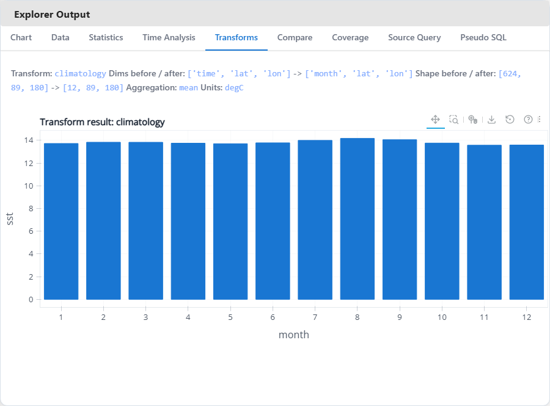

# lumen-xarray-lab

<p align="center">
  
  <span>&nbsp;&nbsp;&nbsp;</span>
  
</p>

<p align="center">
  Prototype evidence for bringing a native <strong>xarray</strong> workflow into <strong>Lumen</strong>.
</p>

<p align="center">
  <a href="docs/architecture.md">Architecture</a> |
  <a href="docs/benchmarks.md">Benchmarks</a> |
  <a href="docs/proposal-alignment.md">Proposal Alignment</a> |
  <a href="docs/reviewer-guide.md">Reviewer Guide</a> |
  <a href="docs/upstream-plan.md">Upstream Plan</a> |
  <a href="examples/dashboard_app.py">Dashboard App</a> |
  <a href="assets/diagrams/xarray_source_proposal_diagram.svg">Proposal Diagram</a>
</p>

<p align="center">
  <strong>xarray-native selection. Lumen-native integration. Proposal-ready proof.</strong>
</p>


## The Problem

Lumen works well once data is already tabular. A lot of the scientific data I
want to explore is not.

When I work with weather, climate, or gridded research datasets, the data
normally starts in xarray-backed formats such as NetCDF or Zarr. The usual
workflow is tedious: open the dataset in xarray, subset it by coordinates,
reduce dimensions, flatten it into a table, and only then move into a dashboard
workflow.

This repo exists to test a cleaner boundary:

- keep coordinate-aware selection and reduction inside xarray
- hand Lumen a bounded, predictable tabular result only at the source boundary
- make schema, metadata, and coordinate roles visible enough for exploration

That is the actual motivation here. The point is not to collect random xarray
features. The point is to remove the preprocessing friction between scientific
data and Lumen.

## Questions This Prototype Is Built Around

- Can I explore gridded scientific data in Lumen without writing one-off preprocessing scripts first?
- Can I ask location-, region-, and time-based questions on xarray-backed datasets and immediately inspect maps, charts, and tables?
- Can I keep the expensive part of the workflow in xarray and only materialize safe tabular results when I need them?

In practice, that means workflows like loading NOAA ERSSTv5, filtering a region
and time range, checking the query cost before flattening millions of cells, and
then inspecting anomaly, rolling-mean, map, or table views in one place.

## Reviewer Summary

> - **Goal:** prove that Lumen can support xarray datasets without losing its tabular source boundary.
> - **Already working here:** runnable explorer, tested source/runtime adapter, CF-aware coordinate detection, multi-file loading, scientific transforms, GeoViews maps, lightweight AI assist, bounded SQL explorer, real-world ERSSTv5 validation, screenshots, GIFs, and benchmark notes.
> - **Upstream position:** this repo is a companion prototype, not a replacement for upstream `lumen`.
> - **Best files to inspect first:** [`docs/architecture.md`](docs/architecture.md), [`docs/proposal-alignment.md`](docs/proposal-alignment.md), [`docs/upstream-plan.md`](docs/upstream-plan.md), [`src/lumen_xarray_lab/datasets.py`](src/lumen_xarray_lab/datasets.py), and [`examples/dashboard_app.py`](examples/dashboard_app.py).

## Implemented Now And Next Plan

| Area | Implemented in this lab now | Next plan |
|---|---|---|
| Source/runtime | local path, URI, bundled sample, upload, and multi-file loading; fallback adapter; schema enrichment; coordinate metadata | upstream `XarraySource` hardening in `lumen/sources/xarray.py` |
| Query boundary | coordinate-aware filters, query previews, pseudo SQL, query planning, `max_rows` protection, metadata roles | focused upstream tests and docs in `lumen/tests/sources/test_xarray.py` and `docs/configuration/spec/sources.md` |
| Scientific workflows | compare, statistics, coverage, time analysis, rolling mean, anomaly, resample, climatology, spatial mean, zonal mean | keep the richer workflow surfaces in the lab until the source boundary is merged |
| Visual proof | explorer UI, GeoViews maps, desktop/mobile screenshots, overview recording, ERSSTv5 validation | use as proposal and PR support rather than upstream payload |
| Experimental work | lightweight AI assist and bounded SQL explorer | keep lab-only unless a stronger upstream use case emerges |


## Next Upstream 

The next upstream-ready slice should stay small and reviewable. The exact target
files are:

- `lumen/sources/xarray.py`
- `lumen/tests/sources/test_xarray.py`
- `docs/configuration/spec/sources.md`
- `examples/xarray_air_temperature.yaml`
- `examples/xarray_air_temperature_demo.py`

Planned scope for that PR:

- stabilize `XarraySource` behavior and metadata
- land focused source tests
- add one clear end-to-end example
- document the supported boundary and current limits

## If You Want To Review This Quickly

1. Watch the [overview recording](docs/media/overview_recording_2026-03-17.mp4).
2. Open the main explorer at [`examples/dashboard_app.py`](examples/dashboard_app.py).
3. Read [`docs/architecture.md`](docs/architecture.md) for the boundary between xarray and DataFrame output.
4. Check [`docs/upstream-plan.md`](docs/upstream-plan.md) for what should move into `lumen`.
5. Run `pytest -q` and `panel serve examples/dashboard_app.py --show`.

## Selected Workflow Screens

### Explorer Surface

<table>
  <tr>
    <td width="72%">
      
    </td>
    <td width="28%">
      
    </td>
  </tr>
  <tr>
    <td><strong>Desktop:</strong> Explorer-style surface with dataset loading, coordinate-aware filters, query previews, chart output, and dataset diagnostics.</td>
    <td><strong>Mobile:</strong> The same workflow rendered in a narrower layout for quick validation and proposal screenshots.</td>
  </tr>
</table>

### Core Data Views

<table>
  <tr>
    <td width="50%">
      
    </td>
    <td width="50%">
      
    </td>
  </tr>
  <tr>
    <td><strong>Data Table:</strong> inspect the current sampled selection directly.</td>
    <td><strong>Spatial Plot:</strong> latitude and longitude role detection unlocks map-style spatial viewing.</td>
  </tr>
</table>

### Analysis And Comparison

<table>
  <tr>
    <td width="50%">
      
    </td>
    <td width="50%">
      
    </td>
  </tr>
  <tr>
    <td><strong>Time Analysis:</strong> raw, rolling mean, anomaly, cumulative, and trend views over the same selection.</td>
    <td><strong>Compare Variables:</strong> align two variables on shared coordinates and inspect joined results.</td>
  </tr>
</table>

### Transform Workflows

<table>
  <tr>
    <td width="50%">
      
    </td>
    <td width="50%">
      
    </td>
  </tr>
  <tr>
    <td><strong>Rolling Mean:</strong> smooth time-series behavior before previewing results.</td>
    <td><strong>Anomaly:</strong> inspect departures from the reference signal without leaving the explorer.</td>
  </tr>
  <tr>
    <td width="50%">
      
    </td>
    <td width="50%">
      
    </td>
  </tr>
  <tr>
    <td><strong>Resample:</strong> temporal aggregation stays inside xarray before tabular preview.</td>
    <td><strong>Climatology:</strong> collapse repeated periods into a cleaner climate summary.</td>
  </tr>
</table>

### Query And Inspection Surfaces

<table>
  <tr>
    <td width="50%">
      
    </td>
    <td width="50%">
      
    </td>
  </tr>
  <tr>
    <td><strong>Pseudo SQL:</strong> a simple tabular mental model for the current selection.</td>
    <td><strong>SQL Explorer:</strong> bounded `SELECT` queries over preview-sized DataFrames for inspection.</td>
  </tr>
</table>

### Map Workflow

<p align="center">
  
</p>

GeoViews map mode adds a stronger scientific-data story than a generic scatter
plot by rendering a curvilinear-grid demo with coastlines.

## Real-World Validation: NOAA ERSSTv5

The screenshots below come from the bundled NOAA ERSSTv5 sea-surface-temperature
dataset at `assets/sample_data/ersstv5.nc`.

This validation pass matters because it exercises a real monthly climate dataset
with `time`, `lat`, and `lon` coordinates, a nearly 10 million-row full
flattening surface, and descending latitude coordinates that forced a real
bugfix in the query helper.

<table>
  <tr>
    <td width="56%">
      
    </td>
    <td width="44%">
      
    </td>
  </tr>
  <tr>
    <td><strong>Spatial overview:</strong> ERSSTv5 loaded directly into the explorer and rendered as a coordinate-aware SST surface.</td>
    <td><strong>Time analysis:</strong> 624 monthly observations summarized as a 12-step rolling mean across non-time dimensions.</td>
  </tr>
  <tr>
    <td width="50%">
      
    </td>
    <td width="50%">
      
    </td>
  </tr>
  <tr>
    <td><strong>Dataset info / CF metadata:</strong> runtime, units, coordinate roles, shape, and source attributes remain visible for a real NOAA dataset.</td>
    <td><strong>Query planning:</strong> filtered ERSSTv5 selections now produce a meaningful cost estimate after fixing descending-latitude range handling.</td>
  </tr>
</table>

## What This Repo Proves

| Claim | Evidence in this repo |
|---|---|
| xarray-backed datasets can be explored through a Lumen-style workflow | `examples/dashboard_app.py`, explorer UI, screenshots, and overview recording |
| coordinate-aware filtering can happen before flattening | `src/lumen_xarray_lab/datasets.py`, query planning, and the current explorer flow |
| schema, metadata, and coordinate roles can be surfaced in the UI | `src/lumen_xarray_lab/cf.py`, dataset info panels, and coordinate-aware views |
| multi-file, transform, and map workflows can stay inside the same source boundary | `open_mfdataset`-aware loading, transform surfaces, GeoViews map mode |
| the work can be tested and documented honestly | `tests/`, `docs/benchmarks.md`, `docs/upstream-plan.md`, generated screenshots |
| the stable core can be separated from demo-only work | fallback runtime design plus the upstream plan docs |

## Architecture

<p align="center">
  
</p>

The important boundary is simple:

- xarray stays responsible for coordinate-aware selection and reduction
- Lumen still receives stable tabular output at the source boundary
- large scientific datasets are filtered before flattening, not after

More detail lives in [`docs/architecture.md`](docs/architecture.md).

## Relationship To Upstream Lumen

This lab repo is intentionally not the main implementation story.

The core contribution should still land in upstream `lumen` through:

- `XarraySource`
- tests
- docs
- runnable examples

The lab repo is where the surrounding proof lives:

- screenshots and recording
- benchmark notes
- demo-first explorer workflow
- experimental features that are not yet ready to merge upstream

## Quick Start

Install the project in editable mode:

```bash
pip install -e .[test]
```

Install the richer demo stack if you want GeoViews maps and media export:

```bash
pip install -e .[demo,test]
```

Run the main examples:

```bash
python examples/quickstart.py
python examples/air_temperature_demo.py
python examples/ai_upload_demo.py
python examples/sql_explorer_demo.py
```

Launch the explorer:

```bash
panel serve examples/dashboard_app.py --show
```

Preload a dataset at startup if you want:

```bash
panel serve examples/dashboard_app.py --show --args "C:\path\to\dataset.nc"
```

Run the test suite:

```bash
pytest -q
```

## Bundled Sample Datasets

The repo includes small local datasets for reliable demos:

- `assets/sample_data/air_temperature.nc`
- `assets/sample_data/rasm.nc`
- `assets/sample_data/ersstv5.nc`
- `assets/sample_data/compare_weather.nc`
- `assets/sample_data/curvilinear_rasm_demo.nc`
- `assets/sample_data/multi_air_temperature/*.nc`

Recommended demo order:

1. `air_temperature` for a clean first walkthrough
2. `multi_air_temperature` for split-file loading
3. `compare_weather` for the compare panel
4. `curvilinear_rasm_demo` for CF metadata and GeoViews maps
5. `ersstv5` for a heavier real-world climate-style dataset
6. `rasm` for the full curvilinear source file behind the smaller demo subset

## Benchmarks And Limits

The benchmark story in this repo is intentionally conservative.

Current published results:

- medium `time x lat x lon` selection estimate: `3,869,000` flattened rows
- rough 4-column DataFrame estimate for that selection: about `118.07 MB`
- large climate-style grid estimate: `378,957,600` rows and about `11.29 GB`
- local NetCDF open timing for the small demo dataset: `0.3703 s`
- split multi-file sample open timing: `1.4488 s` vs `0.5291 s` for the single-file baseline
- ERSSTv5 transform timings: rolling mean `1.7886 s`, anomaly `0.2499 s`, resample `0.2403 s`, climatology `0.1266 s`, spatial mean `0.0933 s`, zonal mean `0.0785 s`

Read the full notes here:

- [Benchmark notes](docs/benchmarks.md)
- [flattening_vs_sql.json](benchmarks/results/flattening_vs_sql.json)
- [netcdf_vs_zarr.json](benchmarks/results/netcdf_vs_zarr.json)
- [large_grid_limits.json](benchmarks/results/large_grid_limits.json)
- [multifile_loading.json](benchmarks/results/multifile_loading.json)
- [transform_timings.json](benchmarks/results/transform_timings.json)

The main takeaway is simple: filter first in xarray, flatten last, and protect
the boundary with `max_rows`.

## Useful Entry Points

- [Architecture notes](docs/architecture.md)
- [Benchmark notes](docs/benchmarks.md)
- [Proposal alignment](docs/proposal-alignment.md)
- [Reviewer guide](docs/reviewer-guide.md)
- [Upstream plan](docs/upstream-plan.md)
- [Dashboard app](examples/dashboard_app.py)
- [Runtime/data layer](src/lumen_xarray_lab/datasets.py)
- [CF helpers](src/lumen_xarray_lab/cf.py)
- [Explorer UI](src/lumen_xarray_lab/dashboard/explorer.py)
- [Proposal diagram](assets/diagrams/xarray_source_proposal_diagram.svg)

## Scope Discipline

This README is intentionally strict about what is real today.

The goal is not to publish the longest feature list. The goal is to make the
repository easy to trust:

- every major claim maps to runnable code
- the public demo matches the current implementation
- benchmarks are published with caveats
- experimental work stays labeled as experimental
